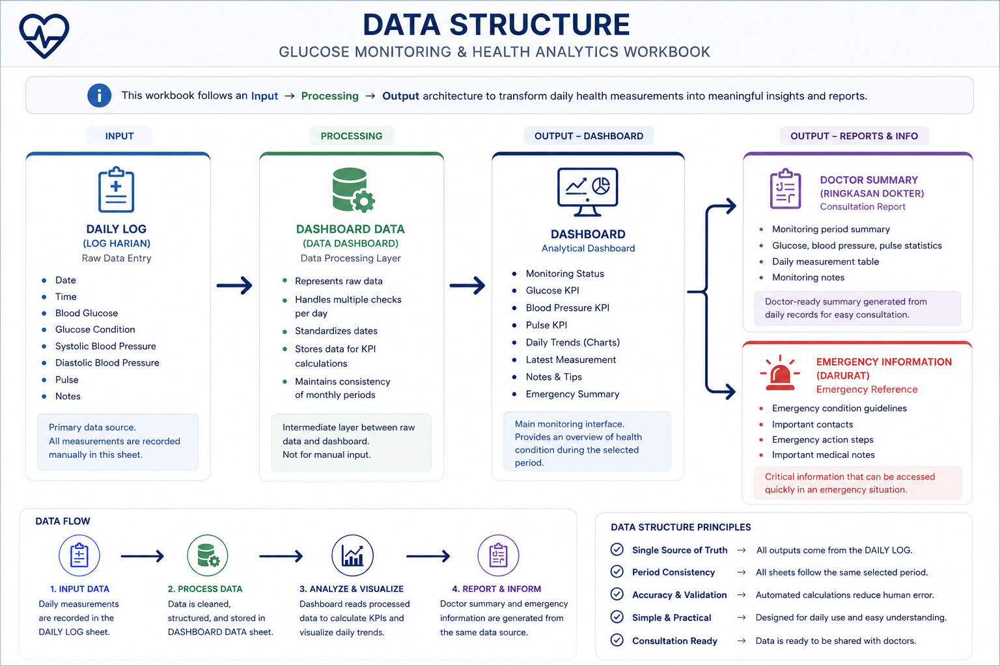
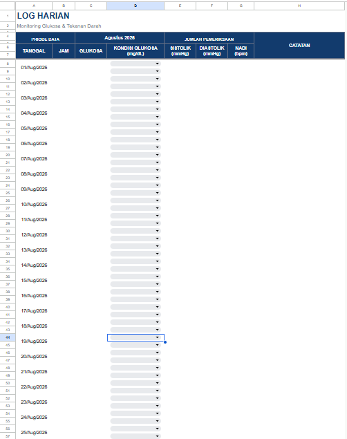
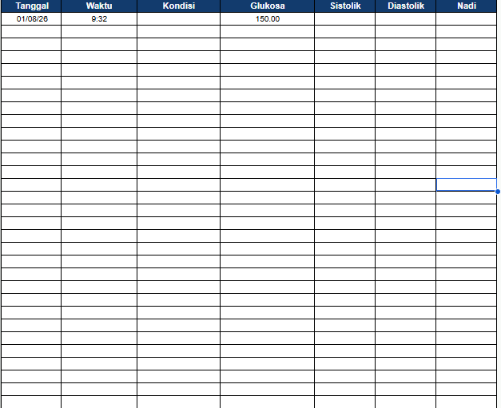
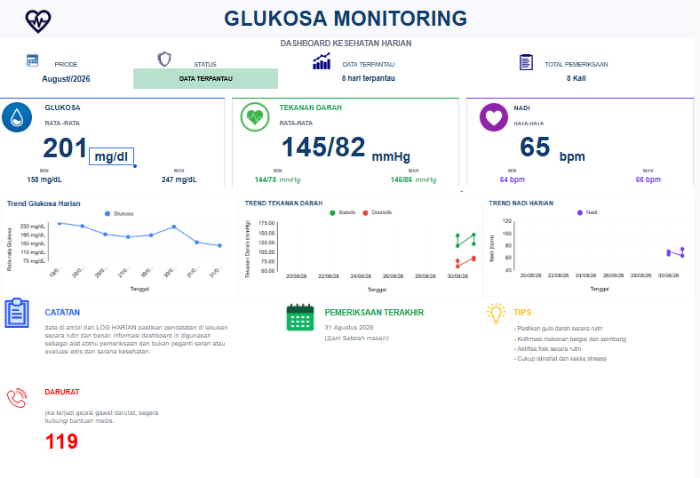
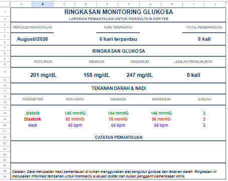

# Glucose Monitoring & Health Analytics Dashboard

> Turning everyday health measurements into structured data, useful insights, and a clearer monitoring process.

## Why I Built This

This project started from something very personal: my mother was diagnosed with diabetes.

Because of her condition, monitoring her health at home became an important part of our daily routine. We regularly recorded measurements such as blood glucose, blood pressure, and pulse.

However, as the amount of data increased, I realized that simply recording numbers was not enough.

The measurements were there, but it was not always easy to answer simple questions such as:

- How many days have been monitored?
- How many measurements were taken?
- What was the average glucose level during a specific period?
- What were the minimum and maximum values?
- How did the measurements change over time?
- How could I prepare a concise summary before a doctor's consultation?

As someone who is learning and developing my skills in Data Analytics, I saw this as an opportunity to apply what I had learned to a problem that was actually meaningful to me.

Instead of keeping the measurements as a simple collection of numbers, I wanted to turn them into a structured monitoring system.

That became the motivation behind this project.

---

# Project Overview

Glucose Monitoring & Health Analytics Dashboard is a Google Sheets-based health monitoring and analytics workbook designed to organize daily home measurements and transform them into useful summaries and visualizations.

The workbook combines:

- Daily data entry
- Data organization
- Automated calculations
- KPI monitoring
- Trend visualization
- Doctor-oriented summaries
- Emergency information

The goal is not to diagnose a medical condition.

The goal is to make existing home-monitoring data easier to record, understand, review, and communicate.

---

# The Problem

Before creating this system, health measurements were primarily recorded as individual daily records.

While this approach works for small amounts of data, it becomes increasingly difficult to understand the bigger picture as more measurements are collected.

For example, looking at individual records does not immediately tell us:

- The overall glucose average
- The highest and lowest measurements
- The number of monitored days
- The total number of examinations
- Blood pressure trends
- Pulse trends
- Important notes associated with measurements

I wanted to create a system that could answer these questions automatically.

---

# My Approach

I designed the workbook around a simple data workflow: INPUT → PROCESSING → ANALYSIS →REPORTING

The system separates data entry from calculations and reporting.

This allows the daily monitoring process to remain simple while the analytical layer handles the calculations automatically.

---

# Data Structure

The workbook follows an Input → Processing → Output architecture.
> 

## 1. Daily Log

The Daily Log is the primary data-entry sheet.

> 

The main variables include:

- Date
- Time
- Blood glucose
- Glucose condition
- Systolic blood pressure
- Diastolic blood pressure
- Pulse
- Notes

I intentionally kept this section simple because the person entering the data should not need to understand the formulas or analytical processes behind the workbook.

---

## 2. Dashboard Data

> 

The Dashboard Data sheet acts as an intermediate processing layer.

It helps organize the monitoring records before they are used by the dashboard.

This layer is responsible for supporting:

- Multiple measurements per day
- Date consistency
- KPI calculations
- Monthly analysis
- Dashboard synchronization

Separating this layer from the daily input sheet also makes the workbook easier to maintain.

---

## 3. Dashboard

> 

The Dashboard is the main analytical interface.

It provides a quick overview of the selected monitoring period, including:

- Monitoring period
- Monitoring status
- Number of monitored days
- Total examinations
- Average glucose
- Minimum glucose
- Maximum glucose
- Blood pressure statistics
- Pulse statistics
- Daily trends
- Latest measurement
- Monitoring notes
- Emergency information

The dashboard was designed with a clean and calm visual style so that important information can be understood quickly.

---

# Key Metrics

The dashboard automatically calculates several important metrics.

## Glucose

- Average glucose
- Minimum glucose
- Maximum glucose
- Total glucose measurements
- Daily glucose trend

## Blood Pressure

- Average systolic pressure
- Average diastolic pressure
- Minimum systolic pressure
- Minimum diastolic pressure
- Maximum systolic pressure
- Maximum diastolic pressure
- Total blood pressure measurements

## Pulse

- Average pulse
- Minimum pulse
- Maximum pulse
- Total pulse measurements
- Daily pulse trend

---

# A Small but Important Data Lesson

One of the most valuable lessons I learned while building this project was the difference between:

    MONITORED DAYS

and

    TOTAL EXAMINATIONS

These two metrics may look similar, but they represent different things.

For example, if measurements are taken twice on the same day:

    1 day monitored
    2 examinations

Simply counting rows would incorrectly treat those two examinations as two monitored days.

During the development process, I encountered this issue and had to redesign the calculation logic.

This taught me an important lesson as a Data Analyst:

> A metric is not meaningful simply because the calculation is mathematically correct. It also needs to represent the right business meaning.

---

# Doctor Summary

> 

The Doctor Summary was created to make the monitoring data easier to review before a medical consultation.

Instead of requiring someone to manually review every daily record, the sheet provides a concise summary of:

- Monitoring period
- Monitored days
- Total examinations
- Average glucose
- Minimum glucose
- Maximum glucose
- Blood pressure statistics
- Pulse statistics
- Monitoring notes

The summary is generated from the same underlying monitoring data used by the dashboard.

This helps maintain consistency between the detailed records and the summarized report.

---

# Data Validation & Quality Checks

Building the workbook was not simply about making formulas work.

I also had to verify whether the numbers produced by the formulas actually represented the underlying data.

During development, I checked:

- Date consistency
- Multiple measurements on the same day
- Monthly filtering
- Average calculations
- Minimum and maximum calculations
- Examination counts
- Dashboard synchronization
- Doctor summary synchronization

Several inconsistencies were discovered during development and corrected.

This validation process became an important part of the project because a dashboard can look correct while still producing incorrect information.

---

# Challenges I Faced

## Multiple Measurements Per Day

Some days contained more than one measurement.

This created challenges when calculating the number of monitored days and total examinations.

I solved this by separating the concept of unique monitoring dates from individual examination records.

---

## Date and Time Handling

Some records contained both dates and specific measurement times.

This required careful handling when filtering records by month.

The formulas were designed around monthly date boundaries so that measurements taken at different times during the same day would still be included correctly.

---

## Dashboard Synchronization

At several points during development, different sheets displayed different values.

Some formulas were still referencing old cells or ranges after the dashboard layout changed.

I had to trace the data flow across the workbook and update the formulas so that the Dashboard and Doctor Summary were using the same period and data source.

---

## Making the Dashboard User-Friendly

Another challenge was finding the right balance between analytical information and simplicity.

Because this workbook is intended for everyday use, I did not want to create an overly complicated interface.

The dashboard therefore focuses on the information that is most useful for quickly reviewing the monitoring history.

---

# Design Philosophy

I called the visual direction of this project:

## Clinical Clean

The design uses a simple color system:

- Navy for the main structure
- Blue for glucose
- Green for blood pressure
- Purple for pulse
- Red only for emergency-related information
- White cards
- Light gray backgrounds
- Minimal borders
- Simple medical icons

I intentionally avoided excessive colors and unnecessary decorations.

The goal was to create something that feels:

    CLEAN
    CALM
    READABLE
    PRACTICAL

rather than simply making a colorful spreadsheet.

---

# Project Outcome

The final workbook transforms daily home measurements into a structured analytics workflow.

The process can be summarized as:

    DAILY MEASUREMENT
            ↓
       DAILY LOG
            ↓
      DATA PROCESSING
            ↓
      AUTOMATED KPI
            ↓
       VISUALIZATION
            ↓
       DOCTOR SUMMARY

The result is a monitoring system that makes the collected data easier to review and understand.

More importantly, it provides a structured way for me to organize health-related information that has personal meaning to my family.

---

# What I Learned

This project taught me more than how to build formulas in Google Sheets.

I learned how to:

- Translate a real-world problem into a data solution
- Design a simple data architecture
- Separate input, processing, and output
- Build dynamic KPI calculations
- Work with date-based filtering
- Handle multiple observations per day
- Validate calculations against raw data
- Define metrics correctly
- Design dashboards for non-technical users
- Create concise reports from detailed records
- Think about data quality beyond just formula correctness

Most importantly, I learned that data analytics does not always have to start with a large dataset or a complex technology stack.

Sometimes it starts with a small problem that matters to you personally.

For me, this project started with my mother's health.

That personal motivation made me look at the data differently.

I was not only asking:

"How can I make this formula work?"

I was also asking:

"Will this information actually be useful for the person who needs it?"

That question shaped many of the decisions I made throughout the project.

---

# Future Improvements

If I continue developing this project, I would like to explore:

- Automated monthly reports
- More flexible date-range filtering
- Automated PDF report generation
- Historical trend analysis
- Automated data backup
- Integration with other data sources
- More advanced anomaly detection

These improvements could transform the workbook into a more complete personal health analytics workflow.

---

# Tools Used

- Google Sheets
- Google Sheets Formulas
- Data Validation
- Conditional Formatting
- Charts
- Dashboard Design

---

# Project Purpose

This project was created as both a practical family project and part of my learning journey in Data Analytics.

It gave me an opportunity to practice data organization, analysis, visualization, dashboard development, and data validation using a problem that was directly connected to my everyday life.

Rather than building a project only for a portfolio, I wanted to build something that had a real reason to exist.

And that is what makes this project meaningful to me.

---

# Disclaimer

This project is intended for personal health monitoring and documentation purposes only.

It is not a medical diagnostic system and should not be used as a substitute for professional medical advice, diagnosis, or treatment.
